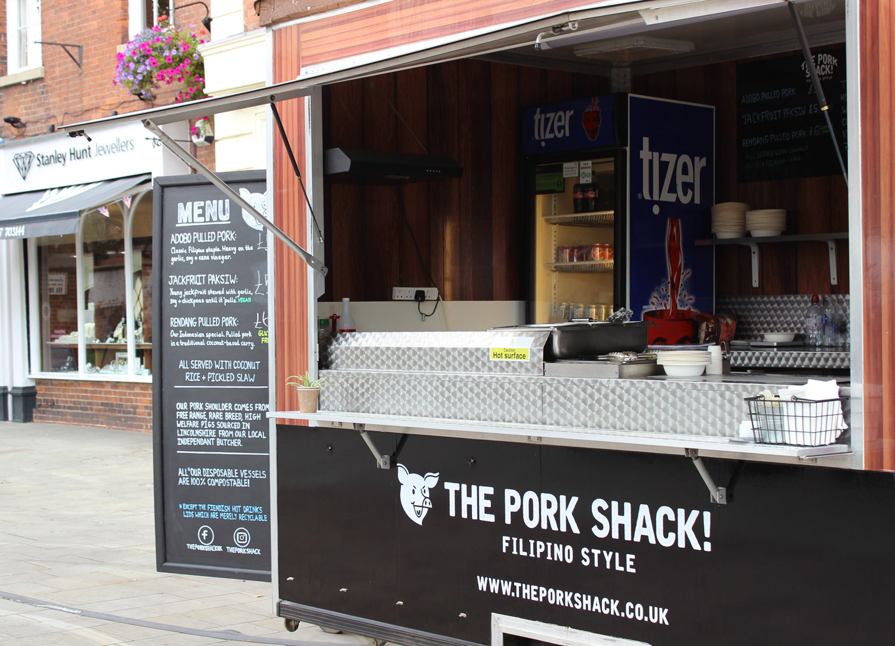
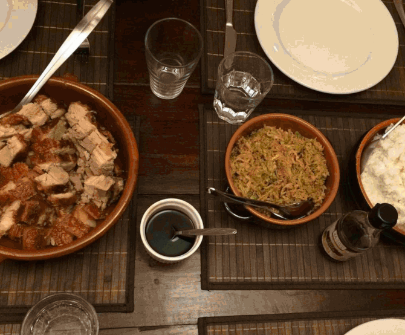

   <!-- Hero message-->
   

    

      

          
      

        

        
We take a modern spin on traditional Filipino dishes by reconstructing popular Filipino family favourites and turning them into street food feasts. We only use good quality fresh ingredients in our dishes, our pork is sourced locally from an independent butcher who supplies free range, rare breed, high welfare pigs.

        

      

    

  

    

      

          

            

              
            

          

          

            

<!-- About Us Section Title -->
              <h3 class="white-text center-align editable">WHO WE ARE</h3>
<!-- About Us Copy -->
              

              Dan and Kayleigh spent 2017 travelling / eating their way through South East Asia on a “make it up as they we go along” travel plan. They decided to take a detour to the Philippines to visit Kayleigh's Lola (Grandma) as she was having an 80th birthday party in Cebu, this was where they fell in love with Filipino food and the idea was born!
              

            

          

      

    

  

   

    

      

        

          

            

                

<!-- Food Section Text -->
                    <h3>Menu</h3>
                    
All our dishes are served with coconut rice and a pickled slaw.

                    <h5>Adobo Pulled Pork</h5>
                    
A modern take on the traditional, rich flavoured, childhood favourite: Adobo. Slow cooked pork shoulder with garlic, soy sauce, bay leaves and vinegar.

                    <h5>Paksiw Pulled Jackfruit (Vegan)</h5>
                    
Paksiw is traditionally made with left over pork and stir fried with garlic, bay leaf, vinegar and soy sauce. We swapped the pork for young jackfruit which has a similar texture and appearance to pulled pork so Veggies and Vegans can have a real taste of the Pork Shack too!

                    <h5>Rendang Pulled Pork</h5>
                    
Rendang is an Indonesion, coconut-based curry, usually served with beef and heavy on the lemongrass. We’ve given it a couple of twists to make it work with our pulled pork and it’s something you have to try if you’ve never experienced a Rendang before. Slightly spicy.
                    
                  

                

                  
                

              

            

        

    

  

  

  

  

    

      

        

          

    <!-- First Section Title -->
            <h1 class="editable">Book us for your next event</h1>
    <!-- First Section Copy -->
            
We’re open to catering your event including weddings, birthdays or any party that you think our delicious menu would be appropriate for. We will aim to work to your requirements, just fill out the form below and we’ll contact you as soon as we can. 

          

        

      

    

  

  

    

      

        

          

<!-- Instagram Section -->
              <h3>Instagram</h3>

<!-- LightWidget WIDGET -->

<iframe src="http://lightwidget.com/widgets/783594d16a635ff2a3725cb9ddfd4b9b.html" scrolling="no" allowtransparency="true" class="lightwidget-widget" style="width:100%;border:0;overflow:hidden; padding-bottom:50px;"></iframe>

          

        

      

